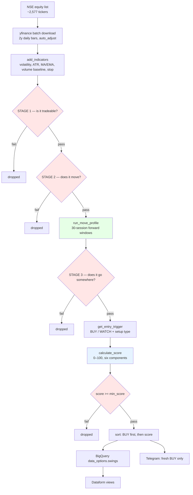

# Pedian — Architecture

**Goal:** find good stocks that can move. Rank them. Never decide the exit.

Everything below is either a **FILTER** (removes a stock) or a **SCORE** (orders
what survived). Knowing which is which is the whole point of this document —
most tuning mistakes come from tightening a filter when you meant to change a
ranking, which silently hides stocks instead of reordering them.

---

## Pipeline

Red = filters (remove). Blue = ranking. Green = measurement.

---

## STAGE 1 — Is it tradeable?

Nothing to do with quality. Can you buy it, and can you afford it.

| knob | value | meaning |
|---|---:|---|
| `min_price` / `max_price` | 250 / 1400 | affordability at your position size |
| `min_avg_traded_value_cr` | 10.0 | ≥ ₹10 Cr traded per day |
| `min_days` | 220 | enough history to measure anything |

> **Liquidity, not market cap.** A ₹1,200 Cr company trading ₹25 Cr/day has more
> real demand behind it than a ₹10,000 Cr company trading ₹2 Cr/day. ANTELOPUS
> was a small cap and was the best trade on record — a market-cap floor would
> have excluded it.

---

## STAGE 2 — Does it move?

The volatility identity. **These four have never changed** and are the core of
the original goal.

| knob | value | meaning |
|---|---:|---|
| `min_avg_volatility` | 3.5 | average daily range/move, over 180 sessions |
| `min_median_volatility` | 2.5 | the median day, not just the wild ones |
| `min_volatile_days` | 30 | at least 30 of 180 sessions were eventful |
| `min_volatility_ratio` | 0.20 | ≥ 20% of sessions were eventful |
| `volatility_lookback` | 180 | ~9 months |

> A stock that became volatile only 30 days ago has its 180-day average diluted
> by 150 quiet sessions, so it reads as calm and is rejected. The scanner
> **cannot see a newly-volatile stock**. That is inherent to a 180-day mean, not
> a bug — but it is a real blind spot.

---

## STAGE 3 — Does the movement go somewhere?

Measured by `run_move_profile`: for every eligible day, look forward 30 sessions
and record the best gain and the worst loss. Both **net of transaction costs**.
No simulated exit — the scanner never models a sell.

| knob | value | meaning |
|---|---:|---|
| `move_horizon_days` | 30 | the window ~6 weeks |
| `min_typical_move_pct` | **10.0** | **the main quality gate** |
| `min_persistence_sample` | 60 | enough windows to trust the median |
| `persistence_lookback` | 180 | how far back to sample windows |
| `max_risk_pct` | 15.0 | backstop against an absurd stop |
| `round_trip_cost_pct` | 0.25 | STT + charges + DP, ~₹25k position |

Outputs three numbers per stock:

- **typical move** — median best gain in 30 sessions
- **typical drawdown** — median worst loss in the same windows
- **tail drawdown** — 10th-percentile worst loss (the *bad* window, not the normal one)

> **`max_risk_pct` must stay loose.** The stop is 1.5 × ATR, so stop distance and
> volatility are the *same variable*. At 8% it rejected 7 of the 8 most volatile
> stocks in the market — including one that typically travels 48.9%. Per-trade
> risk is controlled by **position size**, not by refusing the stock.

> **This distinguishes "volatile" from "moves".** GENESYS is the most volatile
> stock in the universe (6.80%) and is correctly rejected: it only travels 6.3%
> in 30 sessions. It thrashes without going anywhere.

---

## SCORE — ordering what survived

Budget sums to 100. Each component runs from the **minimum admissible** value to
a **genuinely excellent** one — never from zero to an ideal that cannot occur.

| component | pts | scores 0 at | full marks at |
|---|---:|---|---|
| typical move | **40** | `min_typical_move_pct` (10%) | 20% |
| tail drawdown | **20** | −20% | −5% |
| upside dominance | 15 | 50% | 65% |
| setup type | 12 | passive state | breakout |
| move stability | 8 | ≥ 6 | < 4 |
| volume spike | 5 | 1.0× | 3.0× |
| support penalty | −10 | — | −0.6/pt past 8% from support |

**Risk ranks, it does not gate.** Two identical movers with −5% and −20% tails
score 100 and 80. Both appear; one is clearly worse. Gating hid it entirely —
a −12% tail gate excluded SHILPAMED at −15.8%, and a 3.0 gain/pain gate excluded
ANTELOPUS at 2.50. Both were target trades.

`min_score` = 5.0, deliberately near non-binding. `min_typical_move_pct` decides
membership; this only trims the bottom tail.

> **The score is not a forecast.** It orders candidates by fit to what was
> measured. No version of it has been shown to predict forward returns — that
> test needs signal history that does not exist yet.

---

## Entry trigger — the piece still out of step

`get_entry_trigger` labels each candidate BUY or WATCH:

| setup | action | note |
|---|---|---|
| `breakout` | BUY | fires a median **+6.35% after** the move already happened |
| `pullback_bounce` | BUY | buying a dip in an uptrend |
| `reclaim` | WATCH | crossed back above EMA20 |
| `coiling` / `extended` / `below_trend` / `deep_pullback` | WATCH | passive states |

> **Known problem.** Across three samples of 400–500 stocks the setups were
> statistically indistinguishable and their ranking flipped between samples. And
> since Stage 3 now selects stocks that *habitually travel* while the trigger
> wants *breakouts happening today*, the two rarely coincide — most candidates
> come back WATCH and **Telegram goes quiet**, because the digest only pushes
> fresh BUYs. This is the next thing that needs deciding.

---

## Tuning guide

| I want… | turn this | direction |
|---|---|---|
| **a shorter list to read** | **`display_top_n`** | **down (10 → 5)** |
| fewer candidates stored | `min_typical_move_pct` | up (10 → 12 → 15) |
| bigger movers only | `min_typical_move_pct` | up |
| safer candidates ranked higher | `TAIL_PTS` | up (takes from `MOVE_PTS`) |
| cheaper stocks included | `min_price` | down |
| a stricter quality bar | `min_score` | up (5 → 25 → 40) — **but see below** |
| newly-volatile stocks visible | `volatility_lookback` | down — **but see blind spot above** |
| more BUY signals | `breakout_volume_mult` | down (2.3 → 2.0) |

**Rule of thumb:** to change *what you see*, move `display_top_n`. To change
*what exists*, move a Stage 1–3 knob. To change *what ranks first*, move a score
weight. Never use a filter to fix an attention problem.

> **`display_top_n` caps the report, not the data.** A live scan returns ~100
> candidates — a list you skim, not one you act on. It prints and Telegrams the
> top N by score while BigQuery still receives everything.
>
> This matters more than it looks. The signal-history test asks whether score
> buckets 0–20 … 60+ perform differently. If the scanner only *stored* the high
> scores, the low buckets would not exist and the question becomes permanently
> unanswerable. **Never shorten the list by shortening storage.**
>
> And never shorten it by price. Entry price correlates **−0.030** with outcome,
> so a 400–1500 band cuts orthogonally to quality: on a live scan it would have
> deleted GANDHAR (score 71.1, #2 overall), PFOCUS (64.7), INDSWFTLAB (64.2) and
> CUPID (64.2) for being cheap — while still leaving 76 names to read. The top 10
> by score spanned ₹275 to ₹1,169.

---

## What this system does NOT do

- **Decide exits.** By instruction. `position_check.py` reports position state;
  it does not say sell.
- **Fundamentals.** No earnings, debt or growth. Price and volume only.
- **Volume direction.** `volume_spike` is a single-day magnitude with no sign.
  It cannot tell accumulation from distribution. *(untested idea)*
- **Prove its signals work.** See below.

---

## The missing piece

Everything measured so far describes **stocks**: "this one historically makes
large asymmetric moves." Nothing yet tests **signals**: "when this scanner says
BUY today, does buying it produce a good trade?"

That needs a signal-history table — every historical signal with forward returns,
MFE/MAE and stop-hit — then outcomes bucketed by score. If score is real, higher
buckets should perform monotonically better. If 60+ is no better than 30–40, the
score is cosmetic.

**Until that exists, every threshold in this document is set on judgment, not
evidence.**

---

## Deployment

| component | where | schedule (IST) |
|---|---|---|
| `swings.py` | Cloud Run `swings`, europe-west1 | 09:07, 11:00, 13:30, 15:00 |
| `position_check.py` | Cloud Run `position-check`, europe-west1 | 15:45 |
| Dataform | `sudarshan_repo` / `worker1`, us-central1 | triggered after each write |
| BigQuery | `sudarshan-442212.data_options` | — |

> Dataform compiles from the **workspace**, not from git. After changing any
> `.sqlx`, someone must manually Pull in the Dataform UI or scheduled runs keep
> using the old version. Deliberate trade-off: a live git fetch was flaky.

> **Column renames pending.** `Persistence_Rate` → `Upside_Dominance_Pct`,
> `Persistence_Sample` → `Upside_Dominance_Sample`, `Persistence_Stability` →
> `Move_Stability`, `Max_Hold_Days` → `Move_Horizon_Days`, `Target` →
> `Typical_Move_Price`. The `.sqlx` views still reference the old names and will
> show nulls until updated and pulled.
