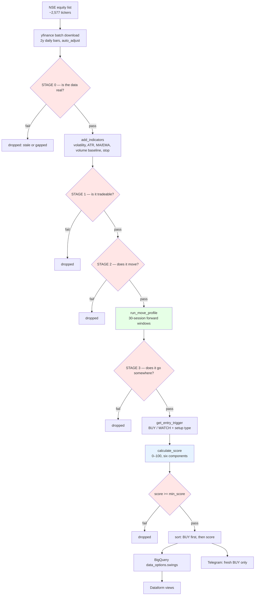

# Pedian — Architecture

**Goal:** find good stocks that can move. Rank them. Never decide the exit.

Everything below is either a **FILTER** (removes a stock) or a **SCORE** (orders
what survived). Knowing which is which is the whole point of this document —
most tuning mistakes come from tightening a filter when you meant to change a
ranking, which silently hides stocks instead of reordering them.

---

## Pipeline

Red = filters (remove). Blue = ranking. Green = measurement.

---

## STAGE 0 — Is the data real?

Added 2026-09-19, after diffing yfinance against Zerodha Kite — the broker the
account actually trades through, and therefore the ground truth.

**Yahoo's prices are correct.** Across 33 overlapping bars for AEROFLEX and
SHILPAMED, OHLCV matched Kite to **0.0000%**. Volume matched exactly. There is
no need to change data provider.

**What is wrong is which bars exist.** Two defects, in opposite directions:

| defect | what Yahoo does | measured scale |
|---|---|---|
| **fabricated holiday bars** | on an NSE holiday, emits `O=H=L=C` = prior close with `Volume=0` | **2.96%** of all bars; affects **100%** of tickers |
| **a 1–2 session coverage lag** | omits the newest sessions for most of the market, then backfills days later | 2026-09-17 absent for **62%** of tickers, 2026-09-18 for **70%** |

And one defect that is ours, not Yahoo's:

| defect | cause | measured scale |
|---|---|---|
| **partial live bars** | scanner runs at 11:00/13:30/15:00 IST and reads a half-finished day | median `Volume_Spike` **0.21** at 11:00 vs **0.95** after close |

**Yahoo's behaviour depends on the time of day, so measure it on a market day.**
The three states are different and a fix calibrated on the wrong one is wrong:

| when | what Yahoo has |
|---|---|
| **11:00 / 13:30 / 15:00** | today's bar, for the **whole universe**, on one single `Bar_Date` — but **partial** |
| **09:07 pre-open** | **mixed** — the 09-18 run wrote `Bar_Date` 09-16, 09-17 *and* 09-18 together |
| after close / weekend | the last 1–2 sessions absent for ~70%, backfilled over following days |

> Verified from the stored runs themselves: on 2026-09-16, 09-17 and 09-18, every
> 11:00/12:00/13:00/15:00 run wrote exactly **one** `Bar_Date` — that day's. Only
> the 09:07 run mixed. So during the session the data **is** current; it is only
> incomplete.

| knob | value | meaning |
|---|---:|---|
| `require_current_bar` | True | last bar must be the reference session |
| `min_session_coverage` | 0.80 | share of the universe that must have a date for it to *be* the reference session |
| `contiguous_sessions_required` | 20 | no holes in the last 20 sessions |
| `trust_partial_volume` | False | while the session is open, `Volume_Spike` is **unknown**, not small |

> **The lag is real, persistent, and not a publishing delay.** Checked on a
> Saturday, ~22 hours after Friday's close, with the market shut: still absent.
> Re-downloading the missing tickers **individually** recovered **0 of 15**, so
> it is not a batch or rate-limit artifact either. Kite confirms all of them
> traded — REDTAPE, SAKUMA, SUPERHOUSE and RAMAPHO all have last-trade times
> between 15:29 and 15:53 on 2026-09-18. Yahoo simply does not have those bars
> yet. Every date **≤ 09-16 had 100% coverage**, which is how we know it
> backfills rather than losing them.

> **Why gaps are a hard reject, not a score penalty.** A stale bar does not make
> a signal lower-quality, it makes it **wrong** — every day-over-day figure
> silently closes over the hole. With 2026-09-17 missing, AEROFLEX's 09-18 close
> move computes as **+6.19%** against a true **+2.67%**, and `prev["High"]`
> becomes 495.00 instead of 512.10, so a close of 510.90 reads as clearing the
> prior high when it did not. **That is a fabricated breakout.**

> **Checking the last bar is not enough.** AEROFLEX on 2026-09-18 *had* a current
> bar and was still missing 09-17 from the middle of its history. Hence
> `contiguous_sessions_required`, which is measured in **sessions, not calendar
> days**, so a holiday is never mistaken for a hole. At 20 it covers every
> rolling window in `add_indicators`. It is nearly free: of 94 tickers with a
> current last bar, requiring 2 clean sessions rejected 36 and requiring 20
> rejected 37. Yahoo's holes cluster at the live edge; older history is clean.

> ### The remaining blind spot — a feed-wide hole
>
> A session Yahoo lacks for *most* of the market cannot be caught this way.
> **2026-09-17 is exactly that**: Kite has it in full, Yahoo has it for ~42%.
> Below the coverage threshold it is excluded from the calendar, so a ticker
> missing it is **not** flagged as gapped — there is no majority to compare it
> against.
>
> Including it instead would reject the ~58% that lack it, which is worse than
> the harm. A feed-wide hole is not a per-ticker defect and cannot be filtered
> like one. So the run **names it in the log** rather than hiding it.
>
> What to discount on such a run: the **one-day-lookback** terms only.
> AEROFLEX's 09-18 close move reads **+6.19%** instead of **+2.67%**, and
> `prev["High"]` becomes 495.00 instead of 512.10 — which can fabricate the
> `closed_above_prev_high` confirmation that `pullback_bounce` requires. The
> 180-day volatility identity and the 30-session move profile are barely
> affected; one distorted bar in 180 does not move a median.

> **The phantom bars all pushed the same way.** A zero-volume day is a maximally
> calm day and a zero sample in the 20-day mean, so it dragged `avg_volatility`,
> `volatility_ratio`, `ATR` and traded value **down** — toward the wrong side of
> four Stage 1/2 gates — while dragging `avg_volume20_prior` down too, which
> **inflated** the next day's `Volume_Spike`. Measured over 2 years on 19
> tickers: ATR understated **5.7%** (worst 11.3%), traded value **6.1%** (worst
> **41.9%**, INDIAGLYCO), and INDIAGLYCO's volume spike read **6.39×** against a
> true **4.39×**. Understated ATR also tightened the 1.5×ATR stop, so `Risk_Pct`
> was reported smaller than the stop actually was.

> **The calendar is derived by coverage, not by recency.** `market_session_calendar`
> samples 150 tickers on an even stride through the universe and keeps the dates
> at least `min_session_coverage` of them has. The reference session is the
> newest surviving date.
>
> **Recency was tried first and was wrong.** Asking ten megacaps for their newest
> bar — on the theory that if any real stock traded that day it was a session —
> is true and useless. Because of the lag, the megacaps' newest bar is a date
> almost nothing else has yet, so that rule **rejected 84% of the universe every
> run**. Coverage-based selection rejects **3%**.
>
> Coverage is bimodal, so the threshold is not delicate: dates are covered
> either ~100% or ~30-42%, with nothing between, and every threshold from
> **60% to 99%** picked the same reference session. Sampling method does not
> matter either — alphabetical-first, alphabetical-last, strided and two random
> draws of 150 all produced the same answer.
>
> If the probe fails, all three checks disable rather than rejecting the
> universe over a network blip.

> **It self-corrects as Yahoo backfills.** Watched live on 2026-09-19: at 13:00
> IST 09-18 had **30%** coverage so the reference was 09-16; by 15:30 IST 09-18
> had reached **100%** and the reference moved to 09-18. No intervention. This
> is why the rule is coverage-based rather than a fixed lag — the lag is not a
> constant to be subtracted.

> **On a market day this costs nothing.** During the session today's bar is the
> newest widely-covered one, so the reference session **is** today and the
> midday runs stay current — they simply treat volume as unmeasured. The lag
> only appears after the close and at weekends, when Yahoo has not finalised the
> latest sessions for most of the market. The run prints the lag whenever it
> exceeds a weekend, so it is never silent.
>
> Where it bites is the **09:07 pre-open** run, which is the one that mixed
> three `Bar_Date` values in a single write. Those tickers are now held back
> rather than stored with a wrong date. What this replaces is strictly worse:
> that run wrote an AEROFLEX row stamped `Bar_Date` 2026-09-16 at score 78.0 —
> the ticker's highest all week — sitting beside genuine same-day rows with
> nothing to tell them apart.

---

## STAGE 1 — Is it tradeable?

Nothing to do with quality. Can you buy it, and can you afford it.

| knob | value | meaning |
|---|---:|---|
| `min_price` / `max_price` | 250 / 1400 | affordability at your position size |
| `min_avg_traded_value_cr` | 10.0 | ≥ ₹10 Cr traded per day |
| `min_days` | 220 | enough history to measure anything |

> **Liquidity, not market cap.** A ₹1,200 Cr company trading ₹25 Cr/day has more
> real demand behind it than a ₹10,000 Cr company trading ₹2 Cr/day. ANTELOPUS
> was a small cap and was the best trade on record — a market-cap floor would
> have excluded it.

---

## STAGE 2 — Does it move?

The volatility identity. **These four have never changed** and are the core of
the original goal.

| knob | value | meaning |
|---|---:|---|
| `min_avg_volatility` | 3.5 | average daily range/move, over 180 sessions |
| `min_median_volatility` | 2.5 | the median day, not just the wild ones |
| `min_volatile_days` | 30 | at least 30 of 180 sessions were eventful |
| `min_volatility_ratio` | 0.20 | ≥ 20% of sessions were eventful |
| `volatility_lookback` | 180 | ~9 months |

> A stock that became volatile only 30 days ago has its 180-day average diluted
> by 150 quiet sessions, so it reads as calm and is rejected. The scanner
> **cannot see a newly-volatile stock**. That is inherent to a 180-day mean, not
> a bug — but it is a real blind spot.

---

## STAGE 3 — Does the movement go somewhere?

Measured by `run_move_profile`: for every eligible day, look forward 30 sessions
and record the best gain and the worst loss. Both **net of transaction costs**.
No simulated exit — the scanner never models a sell.

| knob | value | meaning |
|---|---:|---|
| `move_horizon_days` | 30 | the window ~6 weeks |
| `min_typical_move_pct` | **10.0** | **the main quality gate** |
| `min_persistence_sample` | 60 | enough windows to trust the median |
| `persistence_lookback` | 180 | how far back to sample windows |
| `max_risk_pct` | 15.0 | backstop against an absurd stop |
| `round_trip_cost_pct` | 0.25 | STT + charges + DP, ~₹25k position |

Outputs three numbers per stock:

- **typical move** — median best gain in 30 sessions
- **typical drawdown** — median worst loss in the same windows
- **tail drawdown** — 10th-percentile worst loss (the *bad* window, not the normal one)

> **`max_risk_pct` must stay loose.** The stop is 1.5 × ATR, so stop distance and
> volatility are the *same variable*. At 8% it rejected 7 of the 8 most volatile
> stocks in the market — including one that typically travels 48.9%. Per-trade
> risk is controlled by **position size**, not by refusing the stock.

> **This distinguishes "volatile" from "moves".** GENESYS is the most volatile
> stock in the universe (6.80%) and is correctly rejected: it only travels 6.3%
> in 30 sessions. It thrashes without going anywhere.

---

## SCORE — ordering what survived

Budget sums to 100. Each component runs from the **minimum admissible** value to
a **genuinely excellent** one — never from zero to an ideal that cannot occur.

| component | pts | scores 0 at | full marks at |
|---|---:|---|---|
| typical move | **40** | `min_typical_move_pct` (10%) | 20% |
| tail drawdown | **20** | −20% | −5% |
| upside dominance | 15 | 50% | 65% |
| setup type | 12 | passive state | breakout |
| move stability | 8 | ≥ 6 | < 4 |
| volume spike | 5 | 1.0× | 3.0× |
| support penalty | −10 | — | −0.6/pt past 8% from support |

**Risk ranks, it does not gate.** Two identical movers with −5% and −20% tails
score 100 and 80. Both appear; one is clearly worse. Gating hid it entirely —
a −12% tail gate excluded SHILPAMED at −15.8%, and a 3.0 gain/pain gate excluded
ANTELOPUS at 2.50. Both were target trades.

`min_score` = 5.0, deliberately near non-binding. `min_typical_move_pct` decides
membership; this only trims the bottom tail.

> **The score is not a forecast.** It orders candidates by fit to what was
> measured. No version of it has been shown to predict forward returns — that
> test needs signal history that does not exist yet.

---

## Entry trigger — the piece still out of step

`get_entry_trigger` labels each candidate BUY or WATCH:

| setup | action | note |
|---|---|---|
| `breakout` | BUY | fires a median **+6.35% after** the move already happened |
| `pullback_bounce` | BUY | buying a dip in an uptrend |
| `reclaim` | WATCH | crossed back above EMA20 |
| `coiling` / `extended` / `below_trend` / `deep_pullback` | WATCH | passive states |

> **Known problem.** Across three samples of 400–500 stocks the setups were
> statistically indistinguishable and their ranking flipped between samples. And
> since Stage 3 now selects stocks that *habitually travel* while the trigger
> wants *breakouts happening today*, the two rarely coincide — most candidates
> come back WATCH and **Telegram goes quiet**, because the digest only pushes
> fresh BUYs. This is the next thing that needs deciding.

> **A large part of that was a data bug, now fixed.** A breakout needs
> `breakout_volume_mult` = 2.3×, and the midday runs were comparing a *partial*
> day's volume against a *full*-day baseline. Median `Volume_Spike` by run hour
> IST: **0.21** at 11:00, 0.34 at 12:00, 0.36 at 13:00, 0.62 at 15:00, **0.71–0.95**
> after the close. That is not a volume signal, it is a clock.
>
> Simulated on 340 real tickers by scaling the last bar's volume to the share of
> the day elapsed, under the **old** code:
>
> | run | breakouts found |
> |---|---:|
> | 11:00 (~18% of the day's volume) | **0** |
> | 13:30 (~45%) | 2 |
> | after close (100%) | 4 |
>
> **Zero.** The 11:00 run could not fire a breakout for arithmetic reasons. With
> the volume condition waived while the session is open, the same 340 tickers
> produce **7**.

> **Unknown is not zero.** While the bar is live, `volume_spike` is `NaN`, and
> every reader treats that as *not measured yet*: the breakout gate is **waived**
> rather than failed, the score contributes **0 of 5** — identical to an average
> day, never a penalty — and BigQuery stores **NULL** rather than a number that
> is really a timestamp. Price, trend, pullback and setup are unaffected, because
> they read a current price rather than a day's accumulation.
>
> The honest cost: a midday score tops out at **95**, and a waived breakout is
> unconfirmed by volume. The `Reason` says so — *"Broke 20D high - volume
> unconfirmed, session still open"*.

> **Discarding the live bar was tried and was wrong.** It seems obviously right —
> wait for a complete bar — but on market days Yahoo has today's bar for the
> whole universe while the **previous** session is still missing for most of it.
> So dropping today does not step back one session, it steps back **two**, and
> throws away the only current data there is. Rescaling the baseline by elapsed
> session time was also rejected: NSE intraday volume is U-shaped, so a linear
> fraction badly overstates spikes in the morning.

---

## Tuning guide

| I want… | turn this | direction |
|---|---|---|
| **a shorter list to read** | **`display_top_n`** | **down (10 → 5)** |
| an empty report debugged | check the Stage 0 skip line first | — |
| fewer candidates stored | `min_typical_move_pct` | up (10 → 12 → 15) |
| bigger movers only | `min_typical_move_pct` | up |
| safer candidates ranked higher | `TAIL_PTS` | up (takes from `MOVE_PTS`) |
| cheaper stocks included | `min_price` | down |
| a stricter quality bar | `min_score` | up (5 → 25 → 40) — **but see below** |
| newly-volatile stocks visible | `volatility_lookback` | down — **but see blind spot above** |
| more BUY signals | `breakout_volume_mult` | down (2.3 → 2.0) |

**Rule of thumb:** to change *what you see*, move `display_top_n`. To change
*what exists*, move a Stage 1–3 knob. To change *what ranks first*, move a score
weight. Never use a filter to fix an attention problem.

> **`display_top_n` caps the report, not the data.** A live scan returns ~100
> candidates — a list you skim, not one you act on. It prints and Telegrams the
> top N by score while BigQuery still receives everything.
>
> This matters more than it looks. The signal-history test asks whether score
> buckets 0–20 … 60+ perform differently. If the scanner only *stored* the high
> scores, the low buckets would not exist and the question becomes permanently
> unanswerable. **Never shorten the list by shortening storage.**
>
> And never shorten it by price. Entry price correlates **−0.030** with outcome,
> so a 400–1500 band cuts orthogonally to quality: on a live scan it would have
> deleted GANDHAR (score 71.1, #2 overall), PFOCUS (64.7), INDSWFTLAB (64.2) and
> CUPID (64.2) for being cheap — while still leaving 76 names to read. The top 10
> by score spanned ₹275 to ₹1,169.

---

## What this system does NOT do

- **Decide exits.** By instruction. `position_check.py` reports position state;
  it does not say sell.
- **Fundamentals.** No earnings, debt or growth. Price and volume only.
- **Volume direction.** `volume_spike` is a single-day magnitude with no sign.
  It cannot tell accumulation from distribution. *(untested idea)*
- **Prove its signals work.** See below.

---

## Reconciled against the live account

Checked 2026-09-19 via the Kite MCP server: 19 holdings, 0 open positions, 0
pending orders, 0 GTTs. **12 of the 19 were flagged by the scanner** at some
point between 2026-08-23 and 2026-09-18 — including AEGISLOG, ANTELOPUS, DYCL
and SHILPAMED, the four trades ARCHITECTURE treats as the target pattern.

The seven it never saw are all explained by Stage 1, not by a fault:

| holding | why the scanner cannot see it |
|---|---|
| AUGMONT, MILKYMIST, VIYASH, E2E*, HEG*, SKYGOLD*, AEGISLOG* | held on **BSE**; the universe is the NSE equity list only |
| BSE (₹3,266), DOMS (₹2,113) | above `max_price` 1400 |
| CDSL, IRCTC | in the price band, but below the Stage 2 volatility floor |

\* these four trade on NSE too and *were* flagged there; only the holding sits on BSE.

> **The universe is NSE-only, and three holdings are BSE-only.** `load_nse_tickers`
> reads `EQUITY_L.csv` and `to_yahoo_nse_ticker` appends `.NS`. AUGMONT,
> MILKYMIST and VIYASH have no NSE line at all, so no threshold change will ever
> surface them. `position_check.py` already falls back to `.BO` when `.NS` is
> empty; the scanner does not. *(untested idea: union the BSE list, dedupe by
> ISIN, prefer the more liquid leg.)*

> **`load_nse_tickers` does not filter by series.** It takes every `SYMBOL` in
> `EQUITY_L.csv`, which includes **BE** (trade-to-trade: 100% delivery, no
> intraday, tighter price bands). BLISSGVS-BE is held, and the scanner scans it
> as `BLISSGVS.NS` without knowing the settlement rules differ. *(untested idea:
> keep the `SERIES` column and either filter to EQ or carry it into the output.)*

---

## The missing piece

Everything measured so far describes **stocks**: "this one historically makes
large asymmetric moves." Nothing yet tests **signals**: "when this scanner says
BUY today, does buying it produce a good trade?"

That needs a signal-history table — every historical signal with forward returns,
MFE/MAE and stop-hit — then outcomes bucketed by score. If score is real, higher
buckets should perform monotonically better. If 60+ is no better than 30–40, the
score is cosmetic.

**Until that exists, every threshold in this document is set on judgment, not
evidence.**

---

## Deployment

| component | where | schedule (IST) |
|---|---|---|
| `swings.py` | Cloud Run `swings`, europe-west1 | 09:07, 11:00, 13:30, 15:00 |
| `position_check.py` | Cloud Run `position-check`, europe-west1 | 15:45 |
| Dataform | `sudarshan_repo` / `worker1`, us-central1 | triggered after each write |
| BigQuery | `sudarshan-442212.data_options` | — |

> Dataform compiles from the **workspace**, not from git. After changing any
> `.sqlx`, someone must manually Pull in the Dataform UI or scheduled runs keep
> using the old version. Deliberate trade-off: a live git fetch was flaky.

> **Column renames pending.** `Persistence_Rate` → `Upside_Dominance_Pct`,
> `Persistence_Sample` → `Upside_Dominance_Sample`, `Persistence_Stability` →
> `Move_Stability`, `Max_Hold_Days` → `Move_Horizon_Days`, `Target` →
> `Typical_Move_Price`. The `.sqlx` views still reference the old names and will
> show nulls until updated and pulled.
